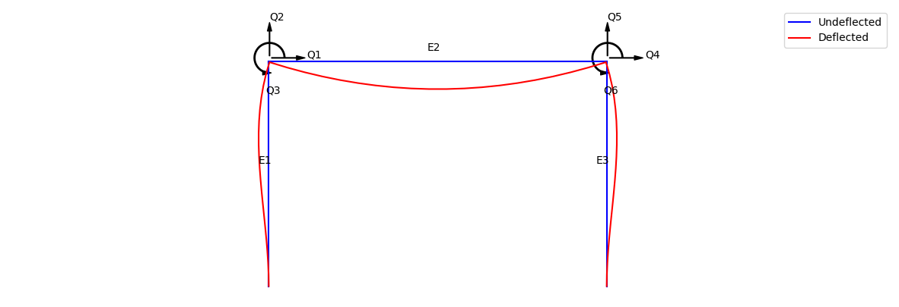

# 2D Finite Element Analysis Package

A simple FEA package developed for a uni course.

## Features
- ability to analyse deflections in a 2D structure
- display the deflected structure
- handles creation of assembly matrices
- display the free body diagrams of the overall structure and individual elements
- very primitive GUI

## Example usage:
```python
from FEA import *

I = 1e-5
A = 5e-4
E = 200e9
L_1 = 3
L_2 = 4.5
L_3 = 3
angle_1 = 90
angle_2 = 0
angle_3 = -90


supports = [
    FixedSupport(Vec2(0, 0)),
    FixedSupport(Vec2(4.5, 0)),
]

elements = [
    Element([Vec2(0, 0), Vec2(0, 3)],       E, I, L_1, A, angle_1),
    Element([Vec2(0, 3), Vec2(4.5, 3)],     E, I, L_2, A, angle_2, UDL=(0, 10e3, 1, -1), point_load=(L_2 / 2, 0, 50e3, 1, -1)),
    Element([Vec2(4.5, 3), Vec2(4.5, 0)],   E, I, L_3, A, angle_3)
]

structure = Structure(elements, supports)

structure.plot_structure(100, 20, deflections=True, annotations=True)
```

### This results in the following graph:
